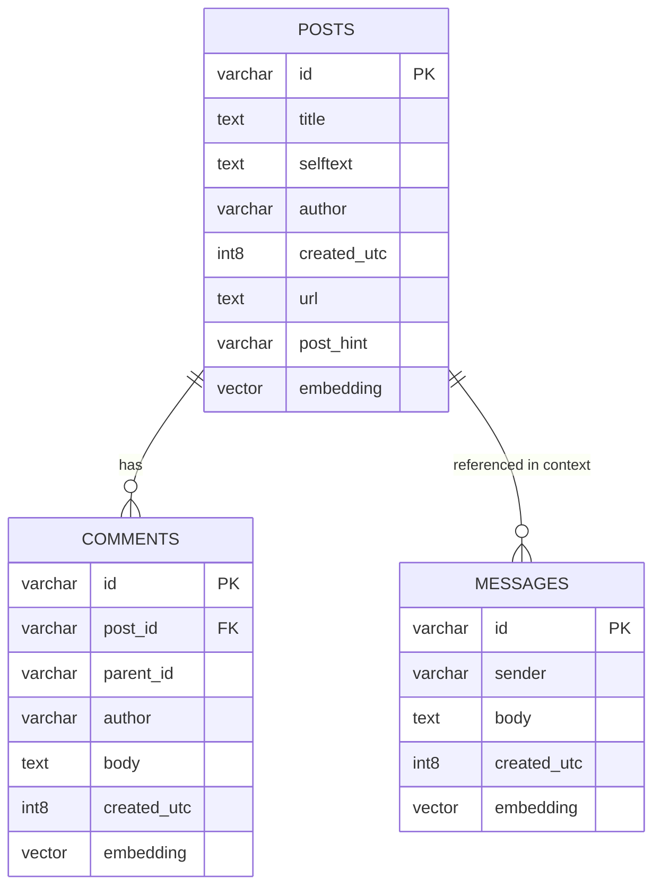

<h1 align="center">
   
  
   
  AskNITJ
   
</h1>

<h4 align="center">u/AskNITJ is a reddit bot designed specifically to help students on r/NITJalandhar</h4>

  
  
  
  

  <h2 align="center">🎃 Hacktoberfest 2025</h2>

  

  <b>AskNITJ</b> is participating in <a href="https://hacktoberfest.com/">Hacktoberfest 2025</a>! 
  If you're passionate about <b>Reddit bots</b>, <b>AI automation</b>, or <b>open-source contributions</b>, this is your chance to jump in.

---

## How does AskNITJ work?

- Uses [Reddit API](https://www.reddit.com/dev/api/) (via [reddit](https://www.npmjs.com/package/reddit)) to fetch posts, comments & inbox messages.
- Stores posts & comments in a database and generates embeddings.
- Compares fetched posts with posts stored in database to distinguish new ones.
- Uses [Gemini API](https://aistudio.google.com/) with context of relevant posts, comments & static wikis.
- Gemini returns an action (`reply || query_user`), where Gemini can either reply or fetch a user's profile for more context if required.

---

## Recommended Resources:

- [How LLMs work with vector databases](https://stackoverflow.blog/2023/10/09/from-prototype-to-production-vector-databases-in-generative-ai-applications/)
- [Vector Database](https://www.ibm.com/think/topics/vector-database)
- [Cosine similarity](https://www.youtube.com/watch?v=e9U0QAFbfLI&ab_channel=StatQuestwithJoshStarmer)

## Database Structure:

---

## AskNITJ Flowchart for Posts:

```mermaid
---
config:
  layout: dagre
---
flowchart TD
 subgraph s1["newPostProcessor()"]
        n3(["Semantic search for context (via embeddings)"])
        n4(["Requests Gemini API with post title, selftext, image (if any), relevant posts, comments & wikis"])
        n5(["Gemini may request user's recent posts/comments for context"])
        n6(["Returns a reply to the post"])
  end

    A(["Fetch newest 5 posts & 20 comments"]) --> n1(["Check for post ids not in seenPostIds (from database)"])
    n1 -- "Pushes new posts to newPostProcessor([...post])" --> B(["Stores the post in database"])
    B --> s1
    n3 --> n4
    n4 --> n5 & n6
    n5 --> n4
    s1 -- "If Gemini can help" --> n7(["Reply to the post using Reddit API"])
    s1 -- "If Gemini cannot help" --> n8(["Ignore post"])
    style s1 fill:#4d4d4d,stroke:#ffffff,stroke-width:1px
```

---

## AskNITJ Flowchart for Comments:

```mermaid
---
config:
  layout: dagre
---
flowchart TD
 subgraph s1["newCommentProcessor()"]
        n3(["Semantic search for context (via embeddings)"])
        n4(["Requests Gemini API with post title, selftext, post comments, comment thread, relevant posts & wikis"])
        n5(["Gemini may request user's recent posts/comments for context"])
        n6(["Returns a reply to the comment"])
  end

    A(["Fetch newest 5 posts & 20 comments"]) --> n1(["Check for comment ids not in seenCommentIds (from database)"])
    n1 -- "Pushes new comments to newCommentProcessor([...comment])" --> B(["Stores the comment in database"])
    B --> n9(["Check: Mentioned u/AskNITJ OR replying to u/AskNITJ OR user is not the bot"])
    n3 --> n4
    n4 --> n5 & n6
    n5 --> n4
    s1 -- "If Gemini can help" --> n7(["Reply to the comment using Reddit API"])
    s1 -- "If Gemini cannot help" --> n8(["Ignore comment"])
    n9 -- "Passes validation" --> s1
    n9 --> n8
    style s1 fill:#4d4d4d,stroke:#ffffff,stroke-width:1px
```

---

## AskNITJ Flowchart for DMs:

```mermaid
---
config:
  layout: dagre
---
flowchart TD
 subgraph s1["newDMProcessor()"]
        n3(["Semantic search for context (via embeddings)"])
        n4(["Requests Gemini API with message, relevant posts, comments & wikis"])
        n5(["Gemini may request user's recent posts/comments for context"])
        n6(["Returns a reply to the message"])
  end

    A(["Fetch newest 5 DMs"]) --> n1(["Check for message ids not in seenMessageIds (from database)"])
    n1 --> n10(["Stores the messages in database"])
    n10 --> B(["Group multiple messages by same user into a single object"])
    n3 --> n4
    n4 --> n5 & n6
    n5 --> n4
    s1 -- "If Gemini can help" --> n7(["Reply to the message using Reddit API"])
    s1 -- "If Gemini cannot help" --> n8(["Ignore DM"])
    B -- "Pushes grouped DMs to newDMProcessor([...message])" --> s1
    style s1 fill:#4d4d4d,stroke:#ffffff,stroke-width:1px
```

---

### 🧩 How to Contribute
1. Fork this repository.
2. Pick an open issue.
3. Create your branch and make improvements.
4. Submit a Pull Request (PR).
5. Once your PR is merged or marked <code>hacktoberfest-accepted</code>, it counts towards your Hacktoberfest progress!

---

Happy hacking, and thank you for supporting open source ❤️  

  <a href="https://github.com/Opensource-NITJ/AskNITJ/issues">🔗 View Issues</a> |
  <a href="https://hacktoberfest.com/">🌐 Learn more</a>

